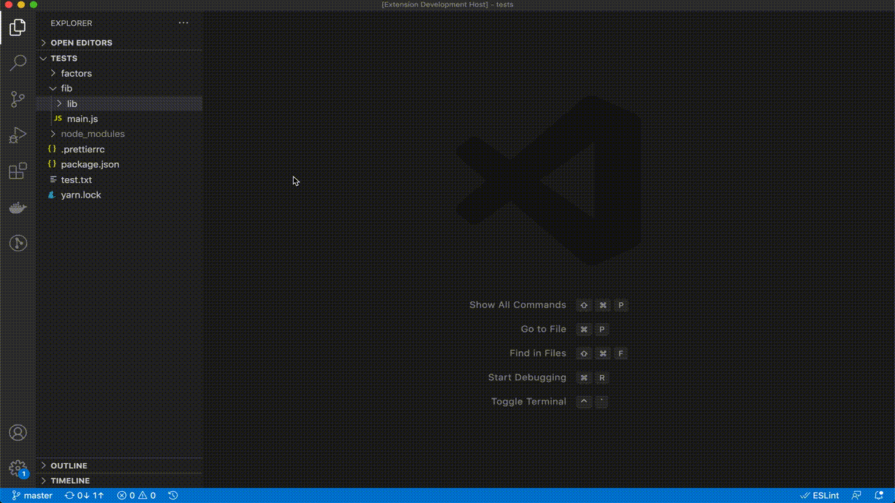
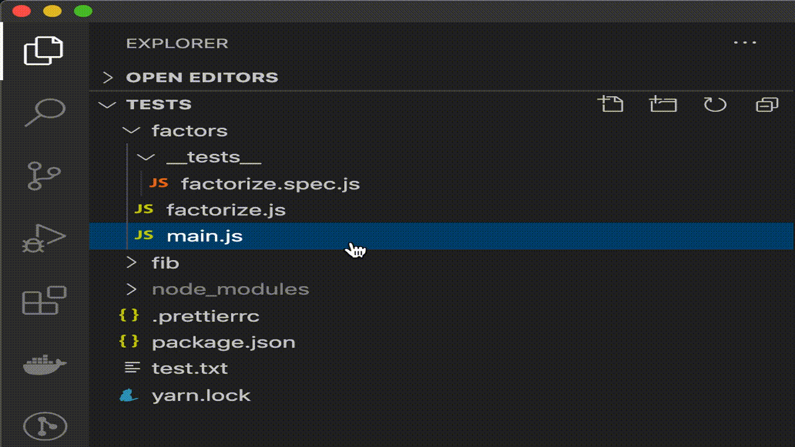
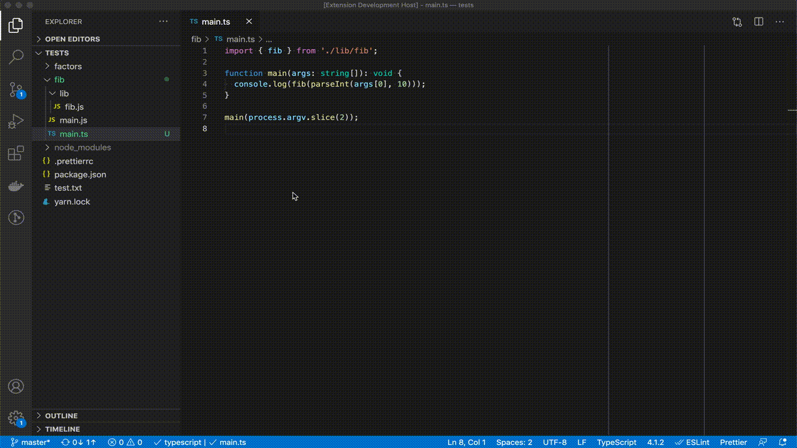
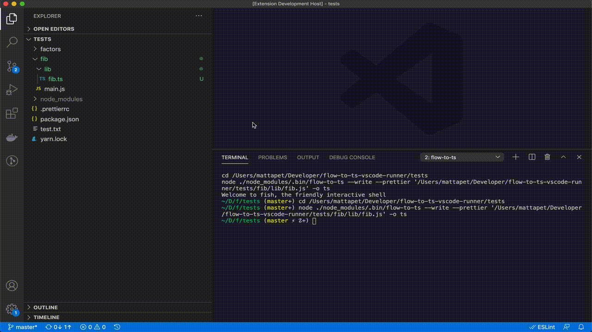

# flow-to-ts-vscode-runner

A simple Visual Studio Code extension for running already existing [CLI tools](#cli-tools-integrated) for migrating Flow to Typescript right from the editor.

## CLI Tools Integrated

- [`flow-to-ts`](https://www.npmjs.com/package/@khanacademy/flow-to-ts)
- [`flowgen`](https://www.npmjs.com/package/flowgen)
- [`typescript`](https://www.npmjs.com/package/typescript)

## Features

### Converting files

### Converting directories

### Generating Typescript definitions from Flow

### Generating Flow definitions from Typescript

